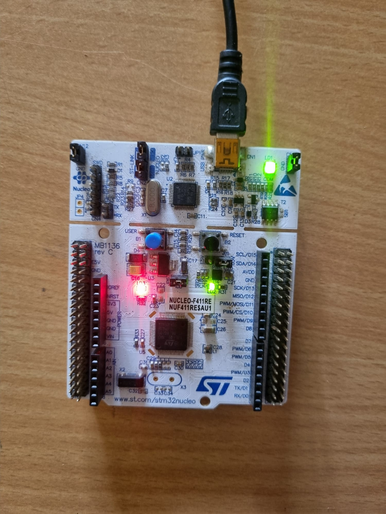
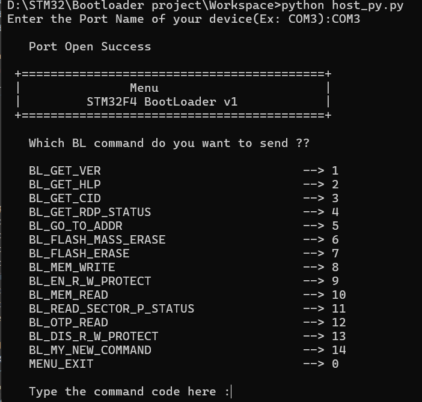
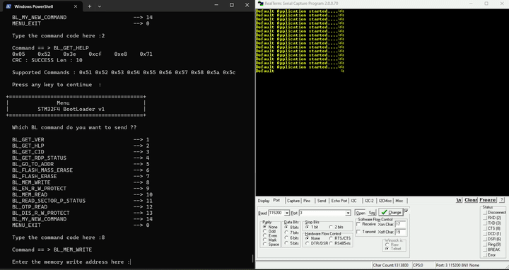
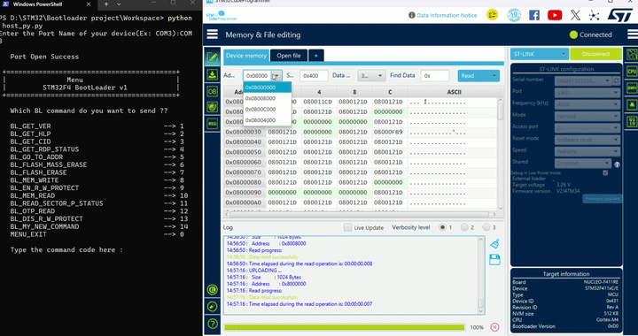
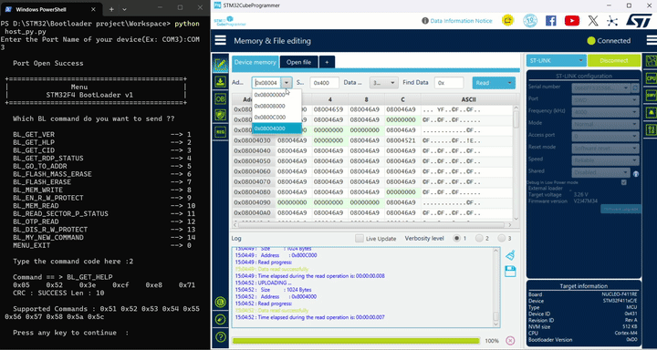
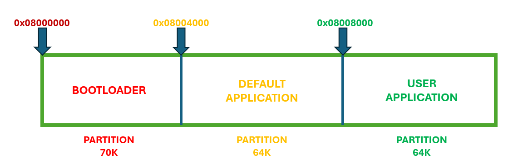

# STM32 UART Bootloader

A custom UART bootloader for the **STM32F411RE**. The project enables reliable in-field firmware updates over UART using a custom packet protocol, CRC32 validation, and a Python host application.

---

## Table of Contents

- [Getting Started](#getting-started)
- [Using the Host Application](#using-the-host-application)
- [Bootloader Commands](#bootloader-commands)
- [Flash Programming](#flash-programming)
- [Flash Erase](#flash-erase)
- [Flash Protection](#flash-protection)
- [Memory Layout](#memory-layout)
- [Project Structure](#project-structure)

---

# Getting Started

## Bootloader Mode

To enter the bootloader:

1. Press and hold the **User Button**.
2. Press the **Reset** button.
3. Release the **Reset** button.
4. Release the **User Button**.

The bootloader indicates it is active by turning **ON the onboard LED** and starts listening for UART commands from the host application.



If the **User Button is not pressed** during reset, the bootloader validates the user application and automatically jumps to the **Default Application**.

---
## Using the Host Application

The Python host utility (`host_py.py`) provides a command-line interface for communicating with the bootloader over UART.



## Bootloader Commands

| Command | Description |
|---------|-------------|
| BL_GET_VER | Get bootloader version |
| BL_GET_HELP | Get supported commands |
| BL_GET_CID | Read MCU Chip ID |
| BL_GET_RDP_STATUS | Read Read-Out Protection level |
| BL_GO_TO_ADDR | Jump to user application |
| BL_FLASH_ERASE | Flash sector/mass erase |
| BL_MEM_WRITE | Program application into Flash |
| BL_EN_R_W_PROTECT | Enable WRP/PCROP |
| BL_READ_SECTOR_STATUS | Read sector protection status |
| BL_DIS_R_W_PROTECT | Disable protection |

> **UART Configuration**
>
> - Baud Rate: **115200**
> - Data Bits: **8**
> - Stop Bits: **1**
> - Parity: **None**

---

# Flash Programming

**Commands:** `BL_MEM_WRITE` → `BL_GO_TO_ADDR`

### Steps

1. Build the user application.
2. Copy the generated **`.bin`** file beside `host_py.py`.
3. Rename the binary to:

```text
user_app.bin
```

4. Enter **Bootloader Mode**.
5. Run the Python host application:

```bash
python host_py.py
```

6. Select **BL_MEM_WRITE**.
7. Enter the application start address (`0x08008000` by default).
8. Wait until the bootloader finishes programming the application into Flash.
9. Select **BL_GO_TO_ADDR**.
10. Enter the same application start address (`0x08008000`).
11. The bootloader validates the application, deinitializes its peripherals, updates the Main Stack Pointer (MSP), and transfers execution to the user application.

> **Note:** Ensure that the application is linked to the same Flash start address used during programming. If the linker address and programming address do not match, the application will not execute correctly.

### Demo

**Flash Programming**



---

# Flash Erase

The bootloader supports both **Sector Erase** and **Mass Erase** operations.

---

## Sector Erase

**Command:** `BL_FLASH_ERASE`

**Steps**

1. Enter Bootloader Mode.
2. Select **BL_FLASH_ERASE**.
3. Enter the starting sector number.
4. Enter the number of sectors to erase.
5. Wait for the erase operation to complete.

**Demo**



---

## Mass Erase

**Command:** `BL_FLASH_MASS_ERASE`

**Steps**

1. Enter Bootloader Mode.
2. Select **BL_FLASH_MASS_ERASE**.
3. Confirm the operation.
4. Wait for the erase to complete.

> **Warning:** Mass erase removes all user applications stored in Flash.

**Demo**




## Status Codes

| Status | Description |
|---------|-------------|
| `FLASH_OK` | Erase completed successfully |
| `FLASH_FAIL` | Erase failed |
| `FLASH_INVALID_SECTOR` | Invalid sector number |

---

# Flash Protection

The bootloader supports enabling and disabling STM32 Flash protection using the Option Bytes.

## Supported Commands

- `BL_EN_R_W_PROTECT`
- `BL_READ_SECTOR_STATUS`
- `BL_DIS_R_W_PROTECT`

### Features

- Enable Write Protection (WRP)
- Enable Proprietary Code Read-Out Protection (PCROP)
- Read sector protection status
- Disable protection

---

# Memory Layout



| Region | Start Address |
|---------|---------------|
| Bootloader | `0x08000000` |
| User Application | `0x08008000` |
| Default Application | `0x08004000` |
| SRAM | `0x20000000` |

---

# Project Structure

```text
STM32-Bootloader
│
├── STM32Bootloader/
│   ├── Core/
│   ├── Drivers/
│   ├── Inc/
│   ├── Src/
│   └── Startup/
│
├── Application 1/
│
├── Default_Application/
│
├── Documents/
│
└── host_py.py
```

---
